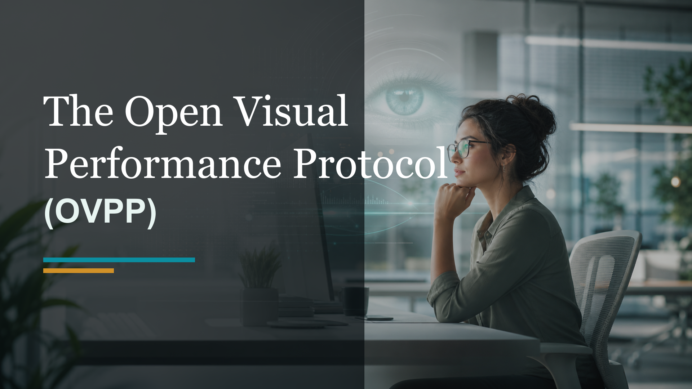

# Open Visual Performance Protocol (OVPP)

<p>
  
</p>

**OVPP is an open, practical protocol for reducing visual friction in screen-intensive work.**

It helps organizations measure visual load, improve work environments, design visual pauses, create a safe referral pathway, and decide whether to scale by evidence instead of intuition.

This protocol is intentionally conservative: it does not replace eye care, does not authorize managers to diagnose employees, and does not expose individual medical information in routine reporting.

## Protocols

- English: [Open Visual Performance Protocol](protocols/open-visual-performance-protocol.md)
- Portugues (PT-BR): [Protocolo Aberto de Desempenho Visual](protocols/protocolo-aberto-desempenho-visual.md)
- Web landing page: [GitHub Pages](https://sudo-psc.github.io/open-visual-performance-protocol/)

## What OVPP Is For

OVPP is designed for organizations that want to:

- treat visual load as an operational variable,
- reduce preventable visual friction with low-risk interventions,
- protect privacy and employee trust,
- separate workplace screening from clinical diagnosis,
- run a 90-day pilot before scaling,
- use evidence bands instead of inflated ROI claims.

## Operating Sequence

The protocol follows one fixed sequence:

1. Anonymous screening baseline
2. Role-level visual load mapping
3. Environment standardization
4. Designed visual pauses
5. Selective referral pathway
6. Re-measurement and governance review

The sequence matters. Universal, low-risk layers come before individual clinical pathways.

## Non-Negotiables

- Measure patterns, not people.
- Use aggregated reporting.
- Keep participation voluntary.
- Use one validated screening instrument during a cycle.
- Keep referral handling separate from performance records.
- Avoid deterministic ROI claims.
- Localize clinical thresholds to local law and licensed care.

## Repo Structure

```text
.
|-- README.md
|-- LICENSE
|-- index.html
|-- assets/
|   |-- ovpp-cover.png
|   `-- site.css
`-- protocols/
    |-- README.md
    |-- open-visual-performance-protocol.md
    `-- protocolo-aberto-desempenho-visual.md
```

## License

The protocol text, website copy, and repository assets are licensed under the [Creative Commons Attribution 4.0 International License](LICENSE), unless otherwise noted.

You may share and adapt the protocol with attribution.

## Suggested Citation

```text
Open Visual Performance Protocol (OVPP). Sudo-psc/open-visual-performance-protocol.
https://github.com/Sudo-psc/open-visual-performance-protocol
```
